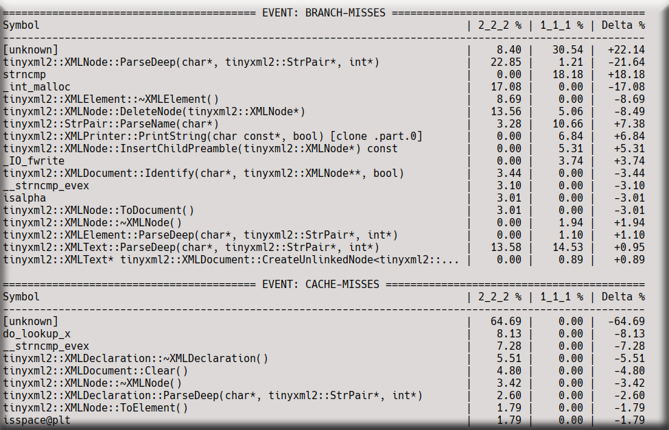

[](https://github.com/ebzych/amphimixis/actions/workflows/ci.yml)
[](https://github.com/ebzych/amphimixis/tree/main/docs)
[](https://github.com/ebzych/amphimixis/blob/main/LICENSE)


# Amphimixis

Amphimixis is an automated project intelligence and evaluation tool for performance and migration readiness. It helps inspect a project for existing infrastructure such as CI, tests, benchmarks, dependencies, and build scripts, then runs builds and collects performance data for further comparison.

> Amphimixis uses `perf` for profiling and can generate a cross‑table comparing two builds per CPU event.

## Performance cross-table example

The cross‑table below was generated using the configuration file on the right. It compares two builds of a YAML‑based project on a local x86 machine (CMake + Ninja, two builds sharing executables via YAML anchors).



**What does the configuration contain?**  
The file on the right defines:
- One x86 platform (address, credentials, SSH port).
- Two recipes with identical compiler flags (`-O2`) and the same toolchain (`g++`).
- Two builds, each referencing the same recipe, both using an executable list tied to a YAML anchor to avoid duplication.

**Why are there zeros in the cross‑table?**  
The two builds were executed on different architectures: `1_1_1` on **RISC‑V** and `2_2_2` on **x86**. Perf events like `cache‑misses` have different naming conventions or are not available on RISC‑V. That is why the first build shows zeros for those metrics, while the second build records actual numbers. The delta column highlights only the differences that appear in both builds, making it easy to spot architecture‑specific behaviour.

## Requirements

- Python 3.12 or later
- Linux
- `rsync` on each machine, `sshpass` on the machine that connects to remote hosts with passwords
- `perf` and `perf archive` on each `run_machine`
- Target project must support CMake as the build system and Make or Ninja as the low-level runner

Installation commands for system dependencies are available in [Troubleshooting → System Dependencies](docs/troubleshooting.md).

## Quick start

If you want to try Amphimixis right away, create a virtual environment, install the package from GitHub, and run the full pipeline on a target project:

```bash
python3 -m venv .venv
source .venv/bin/activate
pip install git+https://github.com/ebzych/amphimixis.git@stable
amixis init local
amixis run /path/to/project --config local.yml
```

## Documentation

- [Usage guide](docs/usage_guide.md) — installation options, workspace setup, all commands, perf events, SSH auth
- [Config instruction](docs/config_instruction.md) — full `input.yml` schema reference
- [Troubleshooting](docs/troubleshooting.md) — common issues and solutions
- [Contributing guide](CONTRIBUTING.md) — how to contribute, local checks, pull request guidelines

## Project structure

The repository is organized around a small CLI and several core modules:

- [amphimixis/amixis/\_\_main\_\_.py](amphimixis/amixis/__main__.py) is the CLI entry point
- [amphimixis/core/analyzer.py](amphimixis/core/analyzer.py) inspects a target project
- [amphimixis/core/builder.py](amphimixis/core/builder.py) runs configured builds
- [amphimixis/core/profiler.py](amphimixis/core/profiler.py) gathers execution and profiling data
- [amphimixis/core/validator.py](amphimixis/core/validator.py) validates `input.yml`
- [amphimixis/core/shell](amphimixis/core/shell) contains local and remote shell backends
- [amphimixis/core/build_systems](amphimixis/core/build_systems) adapts build systems (CMake, Make, Ninja)
- [docs](docs) contains user-facing documentation

## How To Help

Contributions are welcome. Before submitting a pull request, make sure local checks pass:

```bash
ci/runner.sh
```

See [CONTRIBUTING.md](CONTRIBUTING.md) for details on bug reports, pull request guidelines, and test categories.

## License

The project is distributed under the [MIT License](LICENSE). This project includes dependencies under various licenses — see [NOTICE.md](NOTICE.md) and the [third_party_licenses/](third_party_licenses/) directory for details.
