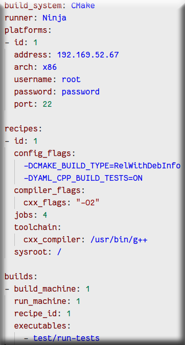

[](https://github.com/ebzych/amphimixis/actions/workflows/ci.yml)
[](https://github.com/ebzych/amphimixis/tree/main/docs)
[](https://github.com/ebzych/amphimixis/blob/main/LICENSE)


# Amphimixis

Amphimixis is an automated project intelligence and evaluation tool for performance and migration readiness. It helps inspect a project for existing infrastructure such as CI, tests, benchmarks, dependencies, and build scripts, then runs builds and collects performance data for further comparison.

Amphimixis simplifies migration readiness exploration and performance analysis by partially implementing our [methodology](docs/migration-readiness-exploring-methodology.md).

> Amphimixis uses `perf` for profiling and can generate a cross‑table comparing two builds per CPU event.

## Performance cross-table example

The cross‑table below was generated using the configuration file on the right. It compares two builds of a YAML‑based project on a local x86 machine (CMake + Ninja, two builds sharing executables via YAML anchors).


**What does the configuration contain?**  
The file on the right defines:
- One x86 platform (address, credentials, SSH port).
- Two recipes with identical compiler flags (`-O2`) and the same toolchain (`g++`).
- Two builds, each referencing the same recipe, both using an executable list tied to a YAML anchor to avoid duplication.

**Why are there zeros in the cross‑table?**  
The two builds were executed on different architectures: `1_1_1` on **RISC‑V** and `2_2_2` on **x86**. Perf events like `cache‑misses` have different naming conventions or are not available on RISC‑V. That is why the first build shows zeros for those metrics, while the second build records actual numbers. The delta column highlights only the differences that appear in both builds, making it easy to spot architecture‑specific behaviour.

## Requirements

- Python 3.12 or later
- Linux
- `rsync` on each machine, `sshpass` on the machine that connects to remote hosts with passwords
- `perf` and `perf archive` on each `run_machine`
- Target project must support CMake as the build system and Make or Ninja as the low-level runner

Installation commands for system dependencies are available in [Troubleshooting → System Dependencies](docs/troubleshooting.md).

## Quick start

If you want to try Amphimixis right away, create a virtual environment, install the package from GitHub, and run the full pipeline on a target project:

```bash
python3 -m venv .venv
source .venv/bin/activate
pip install git+https://github.com/ebzych/amphimixis.git@stable
amixis init local
amixis run /path/to/project --config local.yml
```

<p align="left">



## Note

By default, your working directory must have an `input.yml` or other configuration file that you can specify with the `--config` flag. The format is described in [Config instruction](docs/config_instruction.md).

</p>

If your `input.yml` contains remote machines authenticated with SSH keys, start `ssh-agent` in the current shell and add the required keys manually before running `amixis`:

```bash
eval "$(ssh-agent -s)"
ssh-add ~/.ssh/id_remote_machine
```

## What Amphimixis does

Amphimixis can:

- <i>analyze</i> a project for CI, tests, benchmarks, build system configuration, and dependencies
- <i>build</i> the project with configured recipes and platforms
- <i>profile</i> executable runs and collect timing and `perf`-based statistics
- <i>compare</i> profiling outputs produced for different builds and put them into a <u><i>cross-table for each CPU event</i></u>

## Typical usage

Prepare a working directory with an `input.yml` configuration file. The configuration format is described in [Config instruction](docs/config_instruction.md).

Run the full workflow for a project:

```bash
amixis run /path/to/project
```

This command:

1. analyzes the project
1. builds it using the selected configuration
1. profiles the resulting executables
1. prints profiling results in the console

To compare two collected `perf` outputs:

```bash
amixis compare build1.scriptout build2.scriptout --max-rows 10
```

`compare` accepts exactly two `.scriptout` files. `--max-rows` limits how many symbols with the largest delta are shown for each event.

For step-by-step command examples, custom configuration files, and `--events` usage, see [Usage guide](docs/usage_guide.md).

## Build and run notes

The tool is distributed as a Python package with the `amixis` CLI entry point.

For local development and reproducible checks, the repository uses `uv` and GitHub Actions. The CI configuration is available in [.github/workflows/ci.yml](.github/workflows/ci.yml).

Useful commands during development (run from the repository root, where `pyproject.toml` is located):

```bash
uv run amixis --help
uv run pytest
```

If you want a more detailed walkthrough with installation options, workspace preparation, and command examples, see [Usage guide](docs/usage_guide.md).

## Project structure

The repository is organized around a small CLI and several core modules:

- [amphimixis/amixis/\_\_main\_\_.py](amphimixis/amixis/__main__.py) is the CLI entry point
- [amphimixis/core/analyzer.py](amphimixis/core/analyzer.py) inspects a target project
- [amphimixis/core/builder.py](amphimixis/core/builder.py) runs configured builds
- [amphimixis/core/profiler.py](amphimixis/core/profiler.py) gathers execution and profiling data
- [amphimixis/core/validator.py](amphimixis/core/validator.py) validates `input.yml`
- [amphimixis/core/shell](amphimixis/core/shell) contains local and remote shell backends
- [amphimixis/core/build_systems](amphimixis/core/build_systems) adapts build systems (CMake, Make, Ninja)
- [docs](docs) contains user-facing documentation

## Documentation

Additional documentation:

- [Usage guide](docs/usage_guide.md)
- [Config instruction](docs/config_instruction.md)
- [Migration readiness exploring methodology](docs/migration-readiness-exploring-methodology.md)

## How To Help

Contributions are welcome. Before submitting a pull request, make sure local checks pass:

```bash
ci/runner.sh
```

See [CONTRIBUTING.md](CONTRIBUTING.md) for details on bug reports, pull request guidelines, and test categories.

## License

The project is distributed under the [MIT License](LICENSE). This project includes dependencies under various licenses — see [NOTICE.md](NOTICE.md) and the [third_party_licenses/](third_party_licenses/) directory for details.
